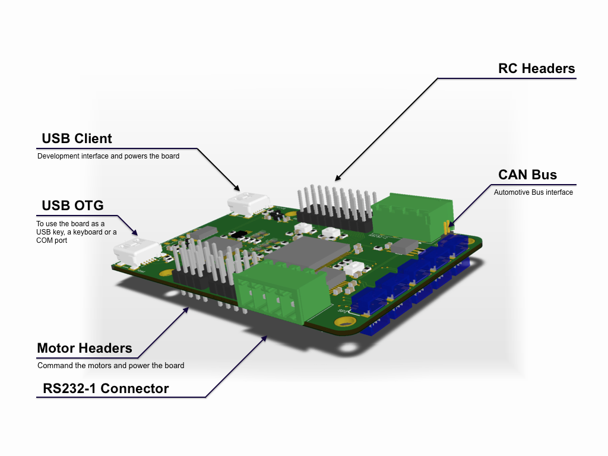

# Home

__Dronolab__ is an expanding student club of the *École de technologie 
supérieure* (ETS) located in downtown Montreal. The mission of the student 
club is to maintain a multirortor (quadcopter) fully autonomous which performs
aerial survey for civil applications. The design and improvement of such a 
constant UAS involves the collaboration of several engineering fields including 
software, electrical and mechanical. The ingenuity, creativity and contribution 
of each program bring the team to achieve professional flights operations.
Please visit our [website](http://dronolab.etsmtl.ca/) for more information.
  
This repository is based on __HiKoB OpenLab__ software. For more information,
please refer to their [wiki](https://github.com/hikob/openlab/wiki).

---

# Boreas

__Boreas__ is *Dronolab's* second, STM32 based, autopilot board. It runs the 
code used to stabilize the drone during flight and what ever else is needed 
on board as long as it doesn't require too much power. It is built around a 
STM32F4 MCU (Cortex-M4 core) and a FT2232 that allows you to program, debug 
and power your platform be only using one USB mini cable.  

