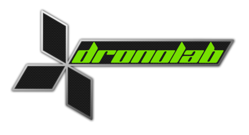

# Home

This repository is based on __HiKoB OpenLab__ software. For more information,
please refer to their [wiki](htpps://github.com/hikob/openlab/wiki).

---

# Boreas

__Boreas__ is *Dronolab's* second, STM32 based, autopilot board. It runs the 
code used to stabilize the drone during flight and what ever else is needed 
on board as long as it doesn't require too much power. It is built around a 
STM32F4 MCU (Cortex-M4 core) and a FT2232 that allows you to program, debug 
and power your platform be only using one USB mini cable.  

